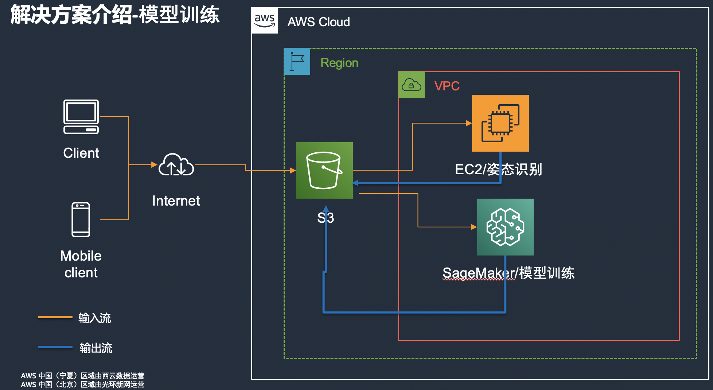

# 使用Sagemaker实现体态识别
## 目录
* 背景
* 解决方案介绍 
* 人体关键点识别
* 基于关键点进行模型实现
* 数据质量提升
* Sagemaker机器学习平台介绍
* 通过Sagemaker实现高低肩识别演示
## 背景
在体育或者舞蹈，瑜伽等训练过程中，会遇到一个关于如何识别动作是否标准的问题，一般都是通过人工进行判断其中存在判断工作量大以及不够准确等问题，本文将介绍如何通过机器学习算法实现自动化识别的过程。
## 解决方案介绍 

1. 客户端上传图片信息（积累训练数据）
2. EC2上部署OpenPose用于人体关键点识别，并将处理后的数据上传到S3
3. 根据处理后的人体关键点信息结合业务场景构建算法模型
4. Sagemaker通过S3上的数据以及构建的算法模型进行训练

1. 客户端上传图片信息
2. 系统自动将上传的图片通过OpenPose实现关键点识别
3. 将识别出的关键点信息作为输入传入Sagemaker托管的模型
4. Sagemaker使用输入数据进行推理返回推理结果
## 人体关键点识别介绍与使用
### OpenPose介绍
* 人体姿态估计，pose estimation，就是通过将图片中已检测到的人体关键点正确的联系起来，从而估计人体姿态。
* 人体关键点通常对应人体上有一定自由度的关节，比如颈、肩、肘、腕、腰、膝、踝等，如下图

参考：https://zhuanlan.zhihu.com/p/37526892
### OpenPose的使用
* 启动windows server ami 
   参考链接（https://docs.aws.amazon.com/zh_cn/AWSEC2/latest/WindowsGuide/connecting_to_windows_instance.html）到widnowsserver 下载openpose安装包（如果提示不支持cuda可以下载1.6.0版本）
* OpenPose安装
下载地址：https://github.com/CMU-Perceptual-Computing-Lab/openpose/releases/download/v1.7.0/openpose-1.7.0-binaries-win64-gpu-python3.7-flir-3d_recommended.zip 
根据安装包中的instruuction.txt操作
* 下载所需模型信息
注意 运行示例后显示失败，获取不到内存等 是因为内存不足导致的，调整机型扩大内存再运行

### 数据准备
#### 数据存储到S3
* 将手工标注数据进行分类
根据手工标注的execl数据，通过代码自动进行数据整理
程序可以根据客户提供的exel中的标注数据对样本进行分类到不同文件夹，将本地的图片根据客户标注的数据进行分类，分为normal 和 abnormal 文件夹便于后续处理。

* 上传数据到S3
```
上传本地原始数据到S3: aws s3 cp normal/ s3://data-lake-mb3/dy/second_week/normal —recursive
windowsserver 服务器下载标注后的数据 
aws s3 s3://data-lake-mb3/dy/second_week . --recursive
```
#### 关键点识别
```
1. Ec2 windows server openpose目录下执行如下命令：
.\bin\OpenPoseDemo.exe --image_dir .\examples\dy\abnormal\ --write_json output/dy/ --write_images output_images/abnormal/ --display 0
2. Ec2 windows server 上传输出信息到S3：
aws s3 cp .\normal\ s3://data-lake-mb3/dy/first_week/key_points/normal/ —recursive
```
### 数据质量的提升
由于数据质量的影响，模型效果很不稳定，经过对数据进行一定的预处理后模型效果趋于稳定主要从以下几个方面对数据质量进行提升。
1. 多人情况下，筛选关键人
2. 图像过暗：需要对图片进行处理
2. 头发遮挡
3. 棉衣遮挡
4. 距离太远
5. 照片拍摄的视角

## 通过Sagemaker实现体态识别
### 数据准备-数据分析
上面提到了关于数据准备阶段的思路以及注意点，针对数据准备阶段有多种方法可以选择，比如Python，Spark，等其他工具，下面我们将使用Sagemaker DataWrangeler 实现数据的分析与处理。Sagemaker DataWrangler的具体介绍参见：https://www.amazonaws.cn/sagemaker/data-wrangler/
```
# Load .flow file
with open(flow_file_name) as f:
    flow = json.load(f)

# Upload to S3
s3_client = boto3.client("s3")
s3_client.upload_file(flow_file_name, bucket, f"{prefix}/{flow_name}.flow")

```

* 创建数据处理流程
```
import time

from sagemaker.workflow.parameters import (
    ParameterInteger,
    ParameterString,
)
from sagemaker.workflow.pipeline import Pipeline


pipeline_name = f"datawrangler-pipeline-{int(time.time() * 10**7)}"
instance_type = ParameterString(name="InstanceType", default_value="ml.m5.4xlarge")
instance_count = ParameterInteger(name="InstanceCount", default_value=1)

boto_session = boto3.session.Session()
region = boto_session.region_name

sagemaker_client = boto_session.client("sagemaker")
runtime_client = boto_session.client("sagemaker-runtime")

sagemaker_session = sagemaker.session.Session(
    boto_session=boto_session,
    sagemaker_client=sagemaker_client,
    sagemaker_runtime_client=runtime_client,
)

pipeline = Pipeline(
    name=pipeline_name,
    parameters=[instance_type, instance_count],
    steps=[step_process],
    sagemaker_session=sagemaker_session
```

* 运行处理流程
```
from botocore.exceptions import ClientError, ValidationError


try:
    response = pipeline.create(role_arn=iam_role)
except ClientError as e:
    error = e.response["Error"]
    if error["Code"] == "ValidationError" and "Pipeline names must be unique" in error["Message"]:
        print(error["Message"])
        response = pipeline.describe()
    else:
        raise

pipeline_arn = response["PipelineArn"]
print(pipeline_arn)
```


从上面流程可以看到通过Sagemaker DataWrangler可以通过界面操作，以及强大的自动生成代码能力可以快速构建自己的可运行的数据处理流程，从而大大降低数据处理和数据处理流程构建的过程，同时为后续模型训练以及与模型训练集成做好准备。

### 模型训练
#### 定义算法&超参数&训练数据
```
region = boto3.Session().region_name
container = sagemaker.image_uris.retrieve("xgboost", region, "1.2-1")
hyperparameters = {
    "max_depth":"5",
    "objective": "binary:logistic",
    "num_round": "4",
    "eval_metric": "auc"
}
train_content_type = (
    "application/x-parquet" if output_content_type.upper() == "PARQUET"
    else "text/csv"
)
train_input = sagemaker.inputs.TrainingInput(
    s3_data=f"s3://{bucket}/{training_path}",
    content_type=train_content_type,
)
```
#### 通过评估器触发训练模型
```
estimator = sagemaker.estimator.Estimator(
    container,
    iam_role,
    hyperparameters=hyperparameters,
    instance_count=1,
    instance_type="ml.m5.2xlarge",
)
estimator.fit({"train": train_input})
```

### 模型部署
```
from sagemaker.serializers import CSVSerializer
xgb_predictor = estimator.deploy(
    initial_instance_count = 1, 
    instance_type = 'ml.m4.xlarge',
    serializer=CSVSerializer())
response = xgb_predictor.predict(input).decode('utf-8')
print(response)
```

### 推理
```
import pandas as pd 
test_data = pd.read_csv('./test.csv')
test_data=test_data.drop(test_data.columns[0],axis=1)##删除没有列名的数据
```
### 模型推理
```
from sagemaker.predictor import Predictor
from sagemaker.serializers import CSVSerializer
endpoint_name = "sagemaker-xgboost-2021-03-17-11-18-11-571" 
input = '0.009085,1.601127e-02'

xgb_predictor = sagemaker.Predictor(endpoint_name=endpoint_name,
                                   sagemaker_session=sess,
                                   serializer=CSVSerializer())
response = xgb_predictor.predict(input).decode('utf-8')
print(response)
if float(response)>0.652 :
    print("1")
else :
    print("0")
```
```
y_true = []
y_pred = []
for i in range(0, len(test_data)):
    input = str(test_data.iloc[i]['0'])+","+str(test_data.iloc[i]['1'])
    response = xgb_predictor.predict(input).decode('utf-8')
    y_true.append(round(test_data.iloc[i]['2']))
    if float(response)>0.6 :
        response=1
    else :
        response=0
    y_pred.append(response)test_data.iloc[i]['2'],response)

```

### 模型评估
```
import matplotlib
import matplotlib.pyplot as plt
from sklearn.metrics import roc_curve, auc, confusion_matrix, f1_score, precision_score, recall_score
#https://scikit-learn.org/stable/modules/generated/sklearn.metrics.confusion_matrix.html
print(confusion_matrix(y_true, y_pred))


[[124  34]
 [108 210]]
TP =124 ，预测正确 存在高低肩问题，而且实际有高低肩问题的数量
FN =108 ，预测错误 不存在高低肩问题，而实际是有高低肩问题的数量
FP = 34 ，预测错误 存在高低肩问题，而实际是不存在高低肩问题的数量
TN = 201,预测正确 不存在高低肩问题，实际也是不存在高低肩问题的数量
```

### 代码运行方法
1. 进入AWS Sagemaker控制台 开启笔记本实例
2. 导入 high-low-shoudler-xgboost.ipynb 导入到笔记本实例
