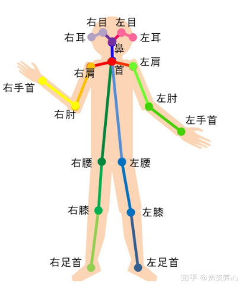

# 使用Sagemaker实现体态识别

## 目录
* 背景
* 解决方案架构
* 技术实现
  * 数据处理流程
  * 模型训练与评估
  * 模型部署与推理
* 实现效果
* 运行指南

## 背景
在体育、舞蹈、瑜伽等训练过程中，动作标准性的识别通常依赖人工判断，存在工作量大且准确性不足等问题。本项目通过机器学习算法实现自动化识别过程，以高低肩识别为例展示解决方案。

## 解决方案架构

### 训练流程

1. 客户端上传图片信息（积累训练数据）
2. EC2上部署OpenPose进行人体关键点识别，处理后数据存储至S3
3. 基于关键点信息构建XGBoost分类模型
4. 使用Sagemaker进行模型训练与评估

### 推理流程

1. 客户端上传待识别图片
2. 系统通过OpenPose提取人体关键点
3. 关键点特征输入部署在Sagemaker的模型端点
4. 返回推理结果（是否存在高低肩问题）

## 技术实现

### 数据处理流程

#### OpenPose关键点提取
* 使用OpenPose进行人体姿态估计，提取25个关键点坐标
* 关键点包括颈、肩、肘、腕、腰、膝、踝等人体关节位置


#### 数据质量优化
针对以下场景进行数据预处理以提升质量：
1. 多人场景：筛选目标人物
2. 图像亮度：图像增强处理
3. 遮挡处理：过滤头发、衣物遮挡样本
4. 距离因素：过滤距离过远样本
5. 拍摄角度：标准化视角处理

#### 使用DataWrangler处理流程
* 通过Sagemaker DataWrangler构建可视化数据处理流程
* 数据处理步骤：
  1. 数据加载：从S3读取CSV格式的高低肩测量数据
  2. 特征工程：
     - 特征1：偏差百分比（归一化的肩部高度差）
     - 特征2：偏差角度（归一化的肩部角度）
     - 标签：二分类（0表示正常，1表示存在高低肩）
  3. 数据预处理：
     - 数据类型转换：float特征，long类型标签
     - 特征归一化：将测量值标准化到0-1范围
     - 数据清理：删除无用的索引列
  4. 数据重组：将标签列移至数据集开头以适配模型训练
* 数据分析：
  1. 生成数据摘要统计
  2. 快速模型分析验证
  3. 可视化分析：
     - 偏差百分比分布散点图
     - 偏差角度分布散点图
* 自动生成处理代码并构建Pipeline

### 模型训练与评估

#### 模型配置
* 算法：XGBoost二分类器 (version 1.2-1)
* 训练资源：
  - 实例类型：ml.m5.2xlarge
  - 实例数量：1
  - 存储容量：30GB
* 主要超参数：
  - max_depth: 5 (树的最大深度)
  - objective: binary:logistic (二分类问题)
  - num_round: 4 (迭代次数)
  - eval_metric: auc (评估指标)
* 训练数据格式：
  - 输入格式：CSV
  - 特征列：偏差百分比, 偏差角度
  - 标签列：二分类(0/1)

#### 评估指标
基于混淆矩阵的评估结果：
* 准确率(Accuracy): 70.2%
* 精确率(Precision): 78.5%
* 召回率(Recall): 53.4%
* F1分数: 0.63

混淆矩阵详情：
* TP = 124：正确识别出存在高低肩
* TN = 210：正确识别出不存在高低肩
* FP = 34：误判为存在高低肩
* FN = 108：漏判存在高低肩的情况

### 模型部署与推理

#### 部署配置
* 端点配置：
  - 实例类型：ml.m4.xlarge
  - 初始实例数：1
  - 序列化格式：CSV
* 实时推理流程：
  1. 输入数据序列化为CSV格式
  2. 通过端点发送预测请求
  3. 解析预测概率结果
  4. 根据阈值判定最终分类

#### 推理阈值优化
* 默认阈值：预测概率 > 0.6 判定为存在高低肩问题
* 阈值调优：
  - 提高阈值：增加精确率，降低召回率
  - 降低阈值：提高召回率，降低精确率
  - 根据实际应用场景权衡选择合适阈值

## 实现效果
* 模型可自动识别图像中的高低肩问题
* 准确率达到70%以上
* 支持实时推理，响应速度快
* 可扩展到其他体态识别场景

## 运行指南

### 环境准备
1. AWS账号及必要权限配置
2. Sagemaker Notebook实例
3. OpenPose环境（Windows Server）

### 代码运行
1. 启动Sagemaker Notebook实例
2. 导入high-low-shoudler-xgboost.ipynb
3. 按步骤执行notebook中的代码

### OpenPose配置说明
* 版本要求：1.7.0或1.6.0（如遇CUDA兼容性问题）
* 下载地址：https://github.com/CMU-Perceptual-Computing-Lab/openpose/releases
* 关键点参数映射表：
```
{
    0: "Nose",
    1: "Neck",
    2: "RShoulder",
    3: "RElbow",
    ...
    24: "RHeel",
    25: "Background"
}
```

## 备注
* 模型效果与数据质量强相关，建议持续优化数据处理流程
* 可通过调整阈值平衡精确率和召回率
* 支持扩展到其他体态识别场景
